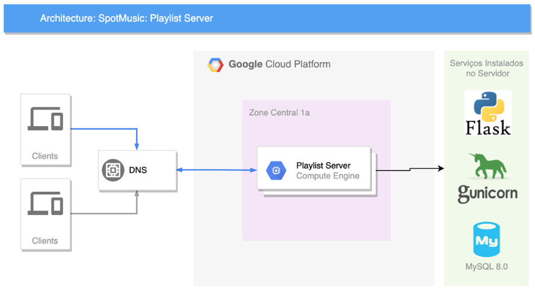

# Fiap Hackaton do curso de Arquitetura de Soluções (2022)

Hackaton do curso de Arquitetura de Soluções (Winner).

## Desafio

Cliente: SpotMusic

Principal produto: Armazenamento de Playlists Musicais

Entregas:

- documento de arquitetura com:
  - AS IS
    - diagrama
    - descrever o cenário atual e os problemas
  - TO BE
    - diagrama
    - decisões arquiteturais
- repositório no Github com:
  - aplicação
  - infraestrutura

## AS IS

- PythonFlask
- MySQL
- GCP usando VM

- Escalabilidade: Quando temos necessidade de escalar o ambiente fazemos isso trocando o tipo da máquina, entregando mais memória e CPU.
- Segurança: Não temos nenhum controle de segurança adicional fora o Firewall nativo do Google, que libera apenas HTTP e SSH para esse servidor.
- Ciclo de Desenvolvimento: Para fazer deploy de uma nova versão da aplicação é manual (upload do código fonte na VM, acesso SSH para fazer o restart);
  - não há controle de versão do código (?);
  - não há controles de segurança.

## TO BE

Versão da POC:

Versão final da solução:

